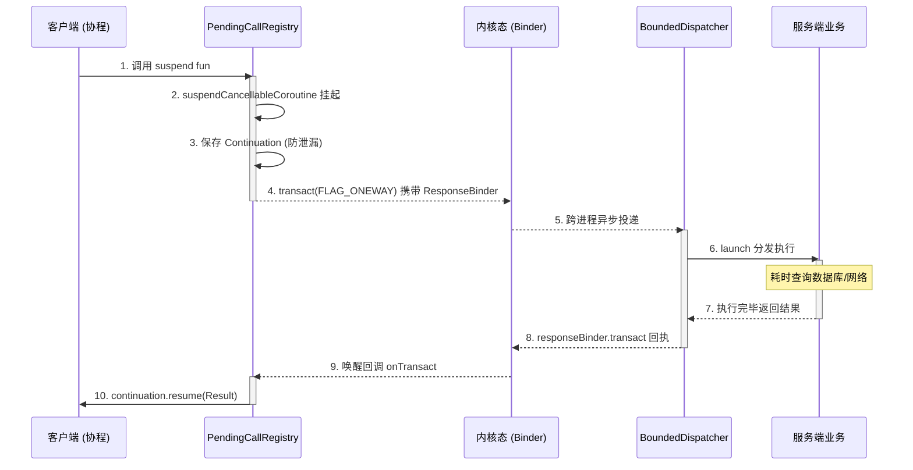
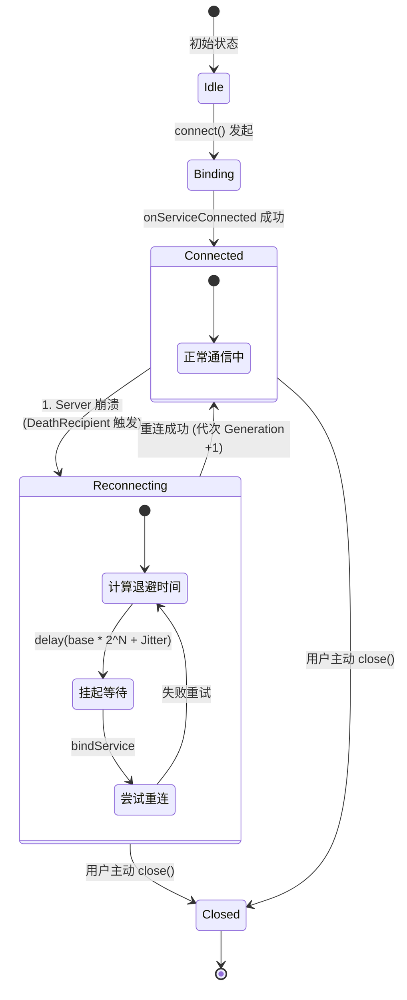

# Modern IPC 架构文档 (Architecture Blueprint)

Modern IPC 是一个完全脱离传统 AIDL 的 Android 跨进程通信框架。它通过编译期注解处理 (KSP) 与 Kotlin 协程 (Coroutines) 及数据流 (Flow) 的深度结合，实现了**高并发**、**全类型安全**、**零死锁**的现代化 IPC 调用体系。

---

## 一、 系统架构全景 (System Overview)

整个系统由四个核心层组成，遵循严格的单向依赖原则：

```mermaid
graph TD
    ClientApp[客户端业务层 App] --> API[ipc-api (接口契约)]
    ClientApp --> ClientEngine[ipc-runtime-client (客户端引擎)]
    
    API --> Annotations[ipc-annotations (元数据)]
    
    ServerApp[服务端宿主 App] --> API
    ServerApp --> ServerEngine[ipc-runtime-server (服务端引擎)]
    
    subgraph KSP Compiler [编译期代码生成器]
        Compiler[ipc-compiler] ..->|扫描 @IpcFacade| API
        Compiler -->|生成| ClientProxy[ClientAdapter 代理类]
        Compiler -->|生成| ServerStub[ServerStub 代理类]
    end
    
    ClientProxy -.->|底层调用| ClientEngine
    ServerEngine -.->|分发给| ServerStub
    
    ClientEngine <===>|Android Binder (内核态)| ServerEngine
```

---

## 二、 核心组件解析 (Core Components)

### 1. 通信契约层 (Annotations & API)
- **`@IpcFacade`**：标记一个普通的 Kotlin `interface` 为 IPC 服务。
- **`@IpcOneway`**：单向调用，无需响应（底层使用 `IBinder.FLAG_ONEWAY`）。
- **`@IpcAsync`**：异步挂起函数，直接返回结果，支持取消。
- **`@IpcStream`**：流式订阅，跨进程桥接 `Flow<T>`，支持多端状态热流订阅 (SharedFlow)。

### 2. 编译期生成层 (KSP Compiler) 技术实现
KSP 处理器在编译期通过解析 `@IpcFacade` 等注解，通过 KotlinPoet 构建出零反射的极速代理类。

- **`ClientAdapter` (客户端代理)**
  不再使用阻塞式的 `reply` Parcel。每次挂起调用，代理层会使用 `FLAG_ONEWAY` (异步) 模式进行 `transact`。
  **序列化协议**：`Parcel` 依次写入 `[requestId(Long)] -> [globalResponseBinder(StrongBinder)] -> [业务参数...]`。
  
- **`ServerStub` (服务端存根)**
  继承自 `android.os.Binder`，在 `onTransact` 方法中生成巨大的 `when(code)` 分发树。
  **反序列化协议**：读取 `requestId` 和回调 `Binder` 后，抛入协程池执行业务。完成后构造 `[requestId] -> [isSuccess(Int)] -> [返回结果]` 的 `replyData`，再通过刚刚读取到的回调 `Binder` 写回结果。

### 3. 客户端引擎 (Client Runtime)
- **`IpcConnectionController`**：状态机引擎。负责与服务端的 `ServiceConnection` 绑定，维护 `Idle -> Binding -> Connected -> Reconnecting -> Closed` 状态，并处理握手协议。
- **指数退避重连 (Exponential Backoff)**：当监听到 `Binder.DeathRecipient`（服务端崩溃死亡）时，自动触发带有随机抖动的重连算法，防止多 Client 瞬间引发重连风暴压垮服务器。
- **`PendingCallRegistry`**：挂起函数调度器。完全非阻塞。在发起调用时获取 `Continuation` 并挂起，收到响应后 `resume`，如果发生协程取消 (Cancel)，则安全移除句柄防内存泄漏。

### 4. 服务端引擎 (Server Runtime)
- **`IpcBrokerService`**：唯一的 Service 暴露点。所有 IPC 调用均从这一个入口进入。
- **`CallerAuthenticator`**：鉴权网关。在建立连接前拦截非法调用，校验来访者的 UID、PID、PackageName 甚至包签名。
- **`BoundedDispatcher`**：服务端线程池与队列限流器。保护服务端免受海量并发请求冲击（抛出 Server Busy 异常而不是直接 OOM 或卡死）。
- **`DefaultIpcServiceRegistry`**：服务路由表。通过 `serviceId` 路由分发到具体业务的 ServerStub。

---

## 三、 通信模型与数据流向

### 场景 A：底层协程挂起与唤醒机制 (Suspend RPC)



### 场景 B：长连接流订阅 (Flow IPC Channel)
传统的 IPC 无法支持连续的数据流推送，Modern IPC 通过 `Channel` 机制重塑了流式通信：
1. **握手创建订阅**：客户端调用 `observeGlobalBroadcast()`，触发 `ClientAdapter` 生成一个冷的 `callbackFlow { ... }`。
2. **注册通道**：`onStart` 生命周期中，客户端发起同步 `transact`，服务端生成全局唯一 `subscriptionId`，并在后台启动独立 `ProducerScope` 进行流的 `collect`。
3. **跨界并发推送**：服务端的流只要一 `emit` 新数据，即刻调用 `responseBinder.transact(FLAG_ONEWAY)`，将二进制数据推入客户端预设的 `callbackFlow` 缓存通道 (`trySend(data)`)。
4. **共享流机制**：如果是服务端定义的 `MutableSharedFlow`，底层则自动实现一对多的分发，不论几个 `ClientAdapter` 分别持有独立的 `subscriptionId`，都会被注册在同一广播源中。
5. **清理通道**：当客户端流所在的作用域被取消（如 ViewModel 销毁），`awaitClose` 块被触发，客户端发送 `unsubscribeTransaction(subscriptionId)` 告知服务端 `cancel` 此流任务。

### 场景 C：容灾与指数退避重连状态机



---

## 四、 性能与稳定性护航

| 威胁场景 | 传统 AIDL 面临的问题 | Modern IPC 的解决方案 |
| :--- | :--- | :--- |
| **高并发请求涌入** | Binder 线程池耗尽，阻塞调用方导致 ANR | 全协程非阻塞调度，服务端通过 BoundedDispatcher 保护系统 |
| **客户端生命周期终结** | 服务端回调已销毁的接口导致 DeadObjectException | KSP 层由 `try-catch` 包裹，客户端句柄自动由 Cancel 机制销毁防泄漏 |
| **服务端意外重启** | 客户端无感或陷入无限死锁等待 | 底层监听 DeathRecipient 自动清空阻塞队列抛出异常，并由状态机自动退避重连 |
| **非法进程盗连** | 业务接口被恶意 APP 暴露调用 | 底层前置 `CallerAuthenticator`，建立通讯协议级严格校验 |

---

*文档生成时间: 2026-09*
