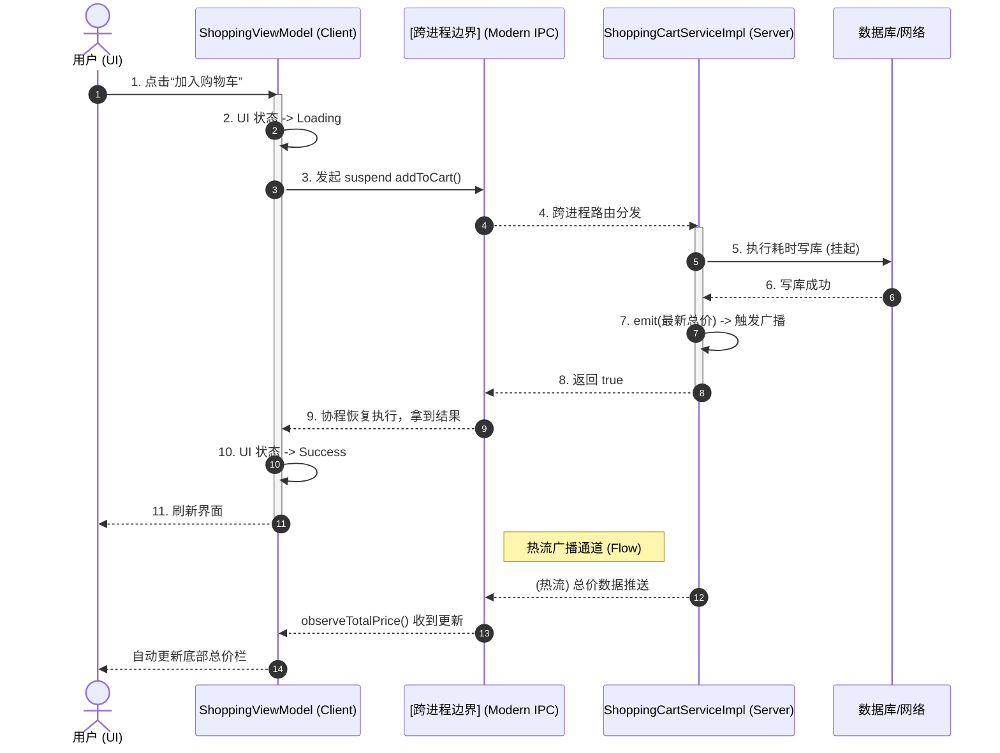

# Modern IPC 业务交互说明 (Business Interaction Guide)

本文档专为 **业务层开发人员** 编写。旨在说明如何使用 Modern IPC 框架进行日常的跨进程业务开发，无需关心底层的 Binder 机制与 KSP 生成原理。

---

## 一、 业务交互核心三步曲

### 📊 典型业务流转全景图
以下是一次典型跨进程业务请求（如：添加购物车并订阅总价）在纯业务视角下的流转过程：



任何一个新增的跨进程业务，都遵循以下三个标准步骤：

### 第一步：在 `ipc-api` 模块定义接口 (契约)
所有的业务接口都必须定义在 `ipc-api` 模块中，以便 KSP 为双端生成代码。

```kotlin
import com.cn.ipc.annotations.*
import kotlinx.coroutines.flow.Flow

@IpcFacade(serviceId = 2001) // serviceId 必须全局唯一
interface IShoppingCartService {

    // 场景 1: 无需知道结果的触发器 (如：埋点、强制刷新)
    @IpcOneway(transaction = 1)
    fun syncCartBadge(count: Int)

    // 场景 2: 需要返回结果的异步查询/修改 (绝大多数业务使用此方式)
    @IpcAsync(requestTransaction = 2, cancelTransaction = 3)
    suspend fun addToCart(skuId: String, amount: Int): Boolean

    // 场景 3: 监听服务端的数据变化长连接 (如：购物车实时总价变化)
    @IpcStream(subscribeTransaction = 4, unsubscribeTransaction = 5)
    fun observeTotalPrice(): Flow<Double>
}
```
**⚠️ 业务须知**：
- `transaction` ID 在同一个接口内必须**绝对唯一**。
- `suspend` 函数支持抛出异常，客户端可以直接 `try-catch` 捕获。
- 复杂对象请确保实现了 `Parcelable`。

---

### 第二步：在 `Server 端` 实现业务逻辑
服务端开发者需要实现上述接口，并注册到 `IpcBrokerService`。

```kotlin
// 1. 实现业务逻辑
class ShoppingCartServiceImpl : IShoppingCartService {
    
    // 使用 SharedFlow 广播总价变化
    private val totalPriceFlow = MutableSharedFlow<Double>(replay = 1)

    override fun syncCartBadge(count: Int) {
        // 瞬间执行，无返回值
        Log.i("Server", "Badge updated: $count")
    }

    override suspend fun addToCart(skuId: String, amount: Int): Boolean {
        // 挂起函数：您可以安全地在这里调用 Room 数据库或 Retrofit 网络请求
        val success = db.insertItem(skuId, amount)
        if (success) {
            totalPriceFlow.emit(db.calculateTotal()) // 触发广播
        }
        return success
    }

    override fun observeTotalPrice(): Flow<Double> {
        return totalPriceFlow
    }
}

// 2. 在 Broker 中挂载 (注册) 路由
class MyBrokerService : IpcBrokerService() {
    override fun onCreateRegistry(): DefaultIpcServiceRegistry {
        val registry = super.onCreateRegistry()
        
        // IShoppingCartServiceServerStub 是编译期自动生成的，直接使用即可
        val stub = object : IShoppingCartServiceServerStub() {
            override val coroutineScope = CoroutineScope(Dispatchers.IO)
            val impl = ShoppingCartServiceImpl()
            
            override fun syncCartBadge(count: Int) = impl.syncCartBadge(count)
            override suspend fun addToCart(skuId: String, amount: Int) = impl.addToCart(skuId, amount)
            override fun observeTotalPrice() = impl.observeTotalPrice()
        }
        
        registry.register(RegisteredService(serviceId = 2001, binder = stub))
        return registry
    }
}
```

---

### 第三步：在 `Client 端` 发起交互 (UI 层)
客户端开发者（如 Activity / Fragment / ViewModel）像调用本地代码一样调用跨进程代码。

#### 3.1 建立连接
通常建议在 `Application` 或核心的 `ViewModel` 中维持一条 IPC 连接：
```kotlin
val controller = IpcConnectionController(context, targetIntent, lifecycleScope)
controller.connect()
```

#### 3.2 业务交互 (以 ViewModel 为例)
框架完全原生支持协程，您可以极其优雅地处理 Loading 状态、网络异常以及生命周期取消。

```kotlin
class ShoppingViewModel(private val controller: IpcConnectionController) : ViewModel() {

    // IShoppingCartServiceClientAdapter 是编译期自动生成的代理类
    private val cartService = IShoppingCartServiceClientAdapter(controller)
    
    val uiState = MutableStateFlow<UiState>(UiState.Idle)

    // 交互 1：发送单向消息
    fun updateBadge(count: Int) {
        cartService.syncCartBadge(count) // 瞬间返回，绝不阻塞 UI
    }

    // 交互 2：发起异步调用并处理 UI 状态
    fun buyItem(skuId: String) {
        viewModelScope.launch {
            uiState.value = UiState.Loading
            try {
                // 发起跨进程调用，当前协程会自动挂起 (不会卡顿主线程)
                val success = cartService.addToCart(skuId, 1)
                uiState.value = if(success) UiState.Success else UiState.Error("库存不足")
            } catch (e: Exception) {
                // IPC 异常（如服务端崩溃、网络断开等）都会在这里被捕获
                uiState.value = UiState.Error(e.message ?: "通信失败")
            }
        }
        // 当 ViewModel 被销毁时，viewModelScope 被取消，底层 IPC 调用也会被**自动拦截并取消**，绝不泄露！
    }

    // 交互 3：订阅实时长连接
    fun listenToPriceChanges() {
        cartService.observeTotalPrice()
            .onEach { price -> 
                // 自动收到来自 Server 进程的数据推送
                updateUIWithPrice(price) 
            }
            .catch { e -> Log.e("Client", "流断开: $e") }
            .launchIn(viewModelScope) 
            // 同样，ViewModel 销毁时，会自动向服务端发送 unsubscribe 指令，精准回收资源。
    }
}
```

---

## 二、 业务最佳实践 (Best Practices)

1. **避免传输超大对象**
   尽管 Modern IPC 处理很高效，但底层仍受制于 Android 内核 Binder 驱动 `1MB` 的事务内存限制（且多进程共享）。如果需要传输图片、视频或超大 JSON，请传递 **`Uri`** 或 **文件路径**，而不是将文件字节加载到内存中传输。

2. **充分利用生命周期绑定**
   永远使用具有生命周期感知的 `Scope` (如 `lifecycleScope`, `viewModelScope`) 发起调用。底层的 `PendingCallRegistry` 专门为此做了优化，只要外部 Scope 被 Cancel，挂起的 IPC 请求立刻无痕销毁，您永远不需要手动编写 `onDestroy` 里的解绑代码。

3. **异常处理机制**
   在 `try-catch` IPC 的挂起函数时，您可能会捕获到 `DeadObjectException`（服务端已死）。如果您不需要对错误进行特殊业务处理，建议让全局的异常捕获器接管。底层的 `IpcConnectionController` 内部具备自愈能力（指数退避重连机制），会在后台自动尝试恢复连接。

4. **流量整形与限流**
   不要在 `for` 循环中毫无节制地发起海量 IPC 请求（尽管框架通过 `BoundedDispatcher` 保护了服务端不被搞崩）。对于高频触发的操作，请在客户端使用 `Flow.debounce()` 防抖后再发起 IPC。

---
*业务文档完。更多架构原理请参见 `ModernIPC_Architecture.md`。*
